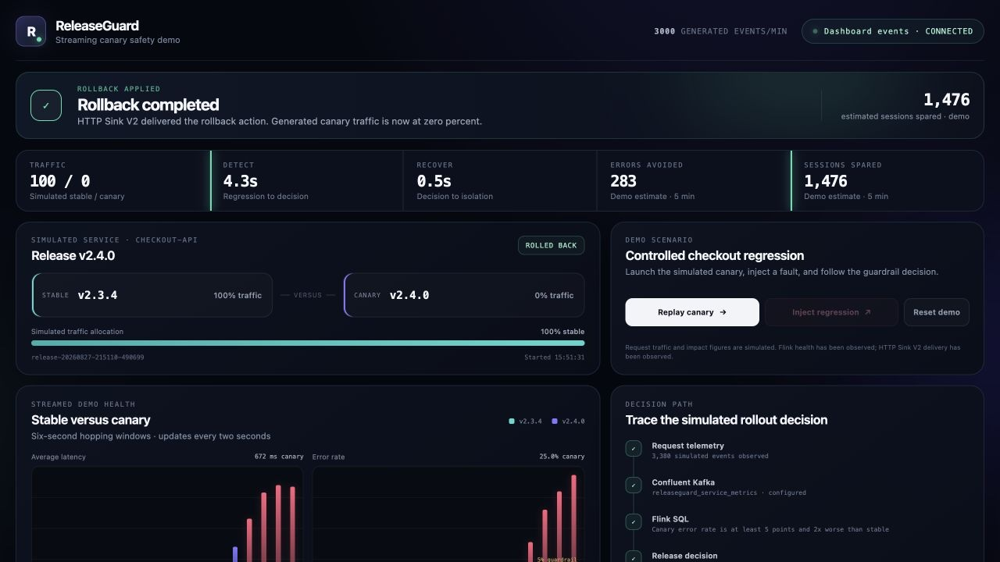
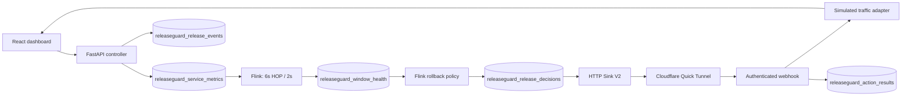

# ReleaseGuard

ReleaseGuard is a canary-release demo built with Confluent Cloud, Flink, FastAPI,
and React. It generates request telemetry for a stable release and a canary,
evaluates both cohorts in six-second windows, and applies a simulated rollback
when the canary crosses an error-rate or latency threshold.



## Scope

The request traffic, injected fault, traffic allocation, and impact estimates
are simulated. In cloud mode, Kafka transport, Avro serialization, Flink SQL,
Schema Registry, and HTTP Sink V2 run in Confluent Cloud. Local mode runs the
same scenario and thresholds in process without cloud credentials.

The rollback adapter changes the demo's in-memory traffic allocation. Duplicate
decision IDs are suppressed for the lifetime of the app process; resetting or
restarting the app clears that state. The Cloudflare Quick Tunnel is intended
only for a short-lived demo webhook.

## Flow

1. `checkout-api` v2.3.4 starts with all simulated traffic.
2. v2.4.0 is launched as a 10% canary.
3. Healthy windows establish the stable and canary baselines.
4. The regression control raises canary latency and failure rate.
5. Flink compares stable and canary health every two seconds.
6. A qualifying breach writes a keyed `ROLLBACK` decision.
7. HTTP Sink V2 posts the decision to the authenticated webhook.
8. The webhook removes the canary from the simulated traffic split and writes
   an action result to Kafka.



The diagram source is in [`docs/architecture.mmd`](docs/architecture.mmd).

## Guardrail policy

Flink waits for at least 50 stable and 10 canary requests in a window. It emits
`ROLLBACK` when either expression is true:

```text
canary_error_rate - stable_error_rate >= 0.05
AND canary_error_rate >= 2 * stable_error_rate

canary_avg_latency_ms >= 1.75 * stable_avg_latency_ms
AND canary_avg_latency_ms - stable_avg_latency_ms >= 150 ms
```

The SQL is in [`infra/flink`](infra/flink). The local evaluator uses the same
thresholds in [`backend/releaseguard/state.py`](backend/releaseguard/state.py).

## Run locally

Docker Desktop and Docker Compose are required.

```bash
./scripts/start_demo.sh
```

Open [http://localhost:8000](http://localhost:8000), launch the canary, wait for
a healthy window, and inject the regression. Local mode does not start a public
tunnel or use Confluent credentials.

To run without Docker:

```bash
python3 -m venv .venv
.venv/bin/pip install -r backend/requirements.txt
npm ci
npm run build
PYTHONPATH=backend .venv/bin/uvicorn releaseguard.app:app --host 0.0.0.0 --port 8000
```

## Run with Confluent Cloud

Cloud mode manages a Standard Kafka cluster, a Flink compute pool, service
accounts, scoped API keys, topics, schemas, two Flink statements, and an HTTP
Sink V2 connector inside an existing Confluent environment. These resources can
incur charges. Terraform displays each plan and asks for approval before it
applies Confluent resource changes.

The bootstrap credential file must use this format:

```text
API key:
your-key
API secret:
your-secret
```

Start cloud mode with:

```bash
CONFLUENT_GLOBAL_KEY_FILE=/absolute/path/to/global-key.txt \
./scripts/start_demo.sh --cloud
```

The Global key is used only by Terraform. The app receives resource-scoped
Kafka and Schema Registry credentials in an ignored `.env.local` file with mode
`600`. The disposable tunnel exposes only `/healthz` and the authenticated
decision webhook; the dashboard and SSE endpoint remain local.

The default environment and region are defined in
[`infra/terraform/variables.tf`](infra/terraform/variables.tf). Override them
with Terraform variables when deploying elsewhere.

## Test

Run the local checks:

```bash
make test
npx playwright install chromium
npm run test:browser
LOCAL_DECISIONS=true \
KAFKA_BOOTSTRAP_SERVERS= KAFKA_API_KEY= KAFKA_API_SECRET= \
SCHEMA_REGISTRY_URL= SCHEMA_REGISTRY_API_KEY= SCHEMA_REGISTRY_API_SECRET= \
make rehearse
terraform -chdir=infra/terraform fmt -check
terraform -chdir=infra/terraform validate
docker compose config --quiet
bash -n scripts/start_demo.sh scripts/teardown_releaseguard.sh
```

The live integration test is opt-in and expects the cloud-mode app to be
running:

```bash
RUN_CLOUD_TESTS=1 \
WEBHOOK_SECRET="$(awk -F= '/^WEBHOOK_SECRET=/{print $2; exit}' .env.local)" \
.venv/bin/pytest tests/test_cloud_integration.py -q -s
```

Detailed test results are recorded in
[`docs/VERIFICATION.md`](docs/VERIFICATION.md).

## HTTP API

- `POST /api/demo/reset`
- `POST /api/demo/canary`
- `POST /api/demo/regression`
- `GET /api/demo/state`
- `GET /api/events`
- `POST /api/v1/release-decisions/{decision_id}`
- `GET /healthz`

The decision webhook requires a Bearer token. Browser-facing controls are not
available through the public tunnel.

## Teardown

Preview the teardown instructions without changing resources:

```bash
./scripts/teardown_releaseguard.sh
```

Destroy all Terraform-managed ReleaseGuard resources only when they are no
longer needed:

```bash
CONFLUENT_GLOBAL_KEY_FILE=/absolute/path/to/global-key.txt \
./scripts/teardown_releaseguard.sh --execute
```

Rotate the bootstrap Global key after it is no longer needed.
